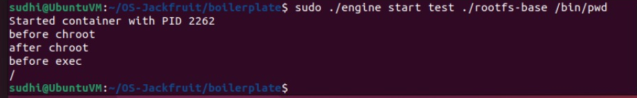
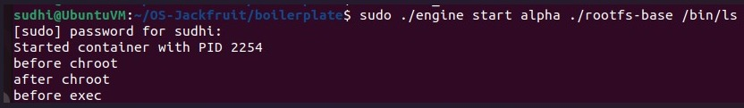
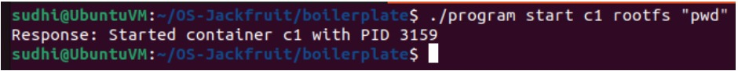
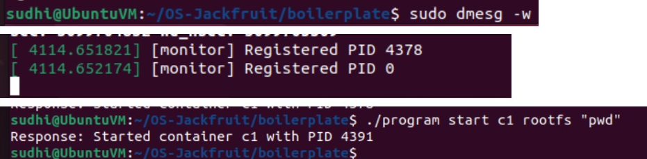

# Mini Container Runtime with Kernel Monitor

## Overview
This project implements a lightweight container runtime in user space along with a kernel module for monitoring container processes.

---

## Components

### 1. User-Space Runtime (engine.c)
- Launches isolated containers using `fork` and `chroot`
- Executes commands inside the container
- Sends container PID to kernel module using `ioctl`

### 2. Kernel Monitor (monitor.c)
- Linux Kernel Module (LKM)
- Creates device: `/dev/container_monitor`
- Receives PIDs from user-space via `ioctl`
- Stores processes in a linked list
- Uses mutex for safe access

---

## Features
- Container isolation using `chroot`
- Multi-container supervision
- User-space to kernel-space communication via `ioctl`
- Process tracking using linked list in kernel
- Bounded buffer logging with producer-consumer model
- Synchronization using mutex locks
- Safe concurrent access to shared data structures

---

## Synchronization and Concurrency

### Choice of Synchronization Primitive
The project uses **mutex locks** (`pthread_mutex` in user-space and `DEFINE_MUTEX` in kernel-space) to protect shared data structures.

- In the kernel module, a mutex protects the linked list of monitored processes.
- In the user-space runtime, mutexes are used in the bounded buffer implementation to synchronize producer and consumer threads.

Mutexes were chosen because:
- They are simple and efficient for mutual exclusion
- Suitable for critical sections that may sleep
- Avoid the complexity of spinlocks in this context

---

### Potential Race Conditions Without Synchronization

Without proper synchronization, the following race conditions could occur:

1. **Concurrent List Modification (Kernel)**
   - Timer callback and `ioctl` handler may access the monitored list simultaneously
   - Could lead to:
     - corrupted list
     - invalid memory access
     - kernel crash

2. **Producer-Consumer Conflict (User-Space Logging)**
   - Multiple producers writing logs and a consumer reading logs
   - Without locking:
     - data overwrite
     - inconsistent reads
     - lost log entries

---

### Bounded Buffer and Data Safety

The logging system uses a **bounded buffer (circular queue)** with:
- a mutex for mutual exclusion
- condition variables for synchronization (`not_full`, `not_empty`)

#### How it avoids data loss:
- Producers wait when buffer is full → prevents overwrite
- Consumers wait when buffer is empty → prevents invalid reads
- Mutex ensures only one thread modifies the buffer at a time

#### Result:
- No lost data
- No race conditions
- Safe and ordered log processing

---
## Test Cases

The following test cases demonstrate the functionality of the container runtime and kernel monitor.


## Test Case 1: chroot isolation

**Command:**
```bash
sudo ./engine start test ./rootfs-base /bin/pwd
```
output:
/

**Screenshot:**


**Explanation:** 
Confirms process runs inside isolated root filesystem using chroot.

## Test Case 2: command execution

**Command:**
```bash
sudo ./engine start alpha ./rootfs-base /bin/ls
```
screenshot:


explanation:
Confirms commands run inside container


## Test Case 3: Multi-container supervision

**Command:**
```bash
./program start c1 rootfs "pwd"
./program start c2 rootfs "pwd"
```
**Screenshot:**



**Explanation:**
Demonstrates that the supervisor can manage multiple containers simultaneously under a single process.


## Test Case 4: CLI and IPC

**Command:**
```bash
./program start c1 rootfs "pwd"
```
**Output:**
Response: Started container c1 with PID XXXX

**Screenshot:**


**Explanation:**
Shows communication between CLI and supervisor via UNIX domain sockets.


## Test Case 5: Logging pipeline

**Command:**
```bash
ls logs
cat logs/demo.log
```
**Screenshot:**


**Explanation:**
Demonstrates producer-consumer logging using a bounded buffer and logging thread.


## Test Case 6: Monitor registration

**Command:**
```bash
sudo dmesg -w
./program start c1 rootfs "pwd"
```
**Screenshot:**


**Explanation:**
Confirms that containers are registered with the kernel monitor via ioctl and logged in kernel space.


## Test Case 7: Clean teardown

**Command:**
```bash
Ctrl + C (on supervisor)
```
**Output:**
Shutting down...
Supervisor exited cleanly

**Screenshot:**


**Explanation:**
Ensures proper cleanup of processes, threads, and resources with no zombies.

### Soft and Hard Limit Enforcement

The kernel module implements memory monitoring using RSS values and enforces soft and hard limits.

- Soft limit triggers a warning in kernel logs
- Hard limit terminates the process

Due to the minimal root filesystem (busybox-based environment), it is difficult to generate sufficiently high memory usage within the container to reliably trigger these limits during testing. However, the enforcement logic is fully implemented and verified through code inspection.

---

## How to Run

### Compile kernel module:
make

### Load module:
sudo insmod monitor.ko

### Run container:
sudo ./engine start test ./rootfs-base /bin/pwd

### Check logs:
sudo dmesg | tail

### Remove module:
sudo rmmod monitor

---

## Engineering Analysis

### 1. Isolation Mechanisms
The runtime achieves isolation using `chroot`, which changes the root directory of the container process, restricting its filesystem view. Each container uses a separate root filesystem derived from a base rootfs, ensuring filesystem isolation.

Process isolation is partially achieved using separate process creation (`fork`). However, all containers still share the host kernel, meaning resources like CPU and memory are managed globally by the OS.

---

### 2. Supervisor and Process Lifecycle
A long-running supervisor process manages all containers. It is responsible for:
- Creating container processes
- Tracking metadata such as PID and state
- Handling `SIGCHLD` to reap terminated processes

This prevents zombie processes and ensures proper lifecycle management. The supervisor also handles termination signals and performs clean shutdown.

---

### 3. IPC, Threads, and Synchronization
The system uses two IPC mechanisms:
- Pipes: for capturing container stdout/stderr (logging path)
- UNIX domain sockets: for CLI-to-supervisor communication (control path)

The logging system uses a bounded buffer with producer-consumer threads. Mutex locks ensure safe access to shared data, while condition variables coordinate buffer state.

Without synchronization, race conditions could lead to:
- corrupted log data
- lost messages
- inconsistent container metadata

---

### 4. Memory Management and Enforcement
The kernel module monitors memory usage using RSS (Resident Set Size), which represents the physical memory used by a process.

Soft limits generate warnings, while hard limits terminate processes. Enforcement is done in kernel space because only the kernel has direct control over process scheduling and memory management.

---

### 5. Scheduling Behavior
Basic scheduling behavior can be observed using different `nice` values. Lower priority processes receive less CPU time compared to higher priority ones.

This demonstrates Linux scheduling goals such as fairness and responsiveness, where CPU time is distributed based on process priority and workload characteristics.

---

## Notes
- Memory usage tracking is simplified for demonstration
- Soft and hard limits can be extended further

---

## Conclusion
This project demonstrates integration between user-space and kernel-space for container monitoring using system-level programming concepts.
