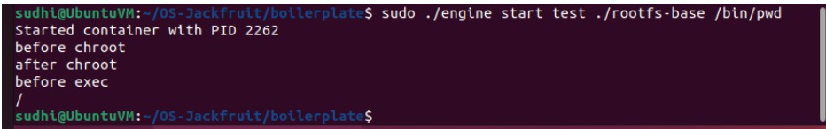

# TEST CASES

## Test Case 1: chroot isolation

command:
sudo./engine start test ./rootfs-base /bin/pwd

output:
/

screenshot:

explanation: confirms process runs inside isolated root filesystem using chroot.

## Test case 2: command execution

command: 
sudo ./engine start alpha ./rootfs-base /bin/ls

screenshot:

explanation:
confirms commands run inside container

