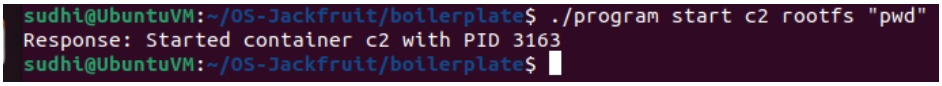
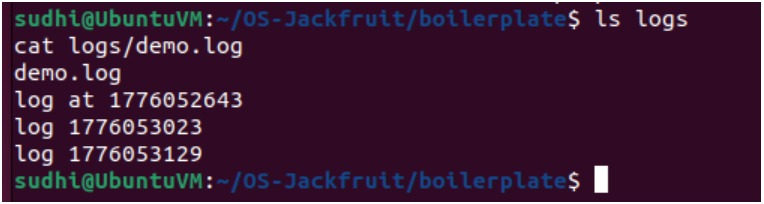
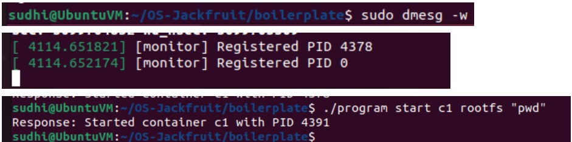
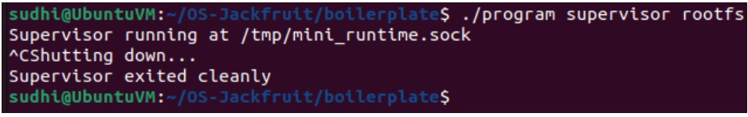

# TEST CASES

## Test Case 1: chroot isolation

command:
sudo./engine start test ./rootfs-base /bin/pwd

output:
/

screenshot:

explanation: confirms process runs inside isolated root filesystem using chroot.

## Test case 2: command execution

command: 
sudo ./engine start alpha ./rootfs-base /bin/ls

screenshot:

explanation:
confirms commands run inside container

## Test Case 3: Multi-container supervision

command:
./program start c1 rootfs "pwd"
./program start c2 rootfs "pwd"

screenshot:

explanation:
demonstrates that the supervisor can manage multiple containers simultaneously under a single process.

## Test Case 4: CLI and IPC

command:
./program start c1 rootfs "pwd"

output:
Response: Started container c1 with PID XXXX

screenshot:

explanation:
shows communication between CLI and supervisor via UNIX domain sockets.

## Test Case 5: Logging pipeline

command:
ls logs
cat logs/demo.log

screenshot:

explanation:
demonstrates producer-consumer logging using a bounded buffer and logging thread.

## Test Case 6: Monitor registration

command:
sudo dmesg -w
./program start c1 rootfs "pwd"

screenshot:

explanation:
confirms that containers are registered with the kernel monitor via ioctl and logged in kernel space.

## Test Case 7: Clean teardown

command:
Ctrl + C (on supervisor)

output:
Shutting down...
Supervisor exited cleanly

screenshot:

explanation:
ensures proper cleanup of processes, threads, and resources with no zombies.
